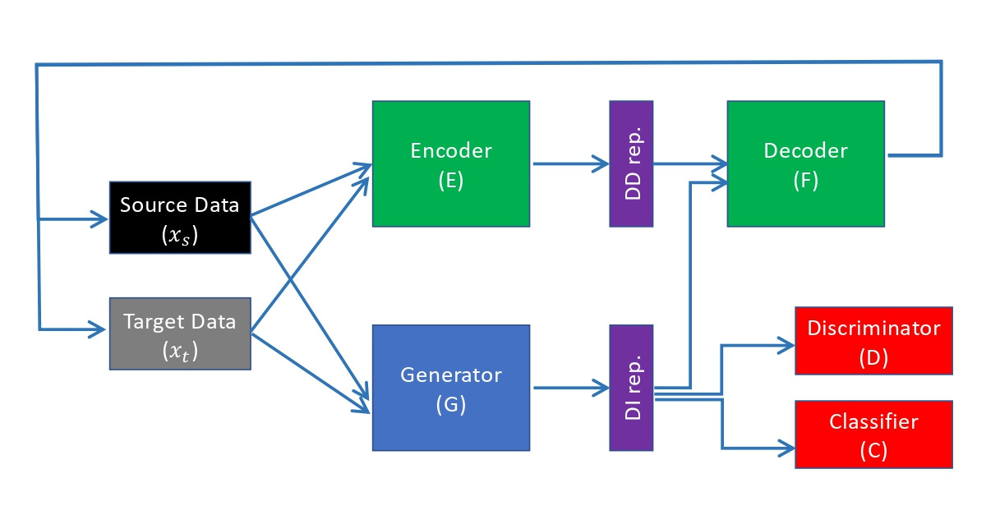
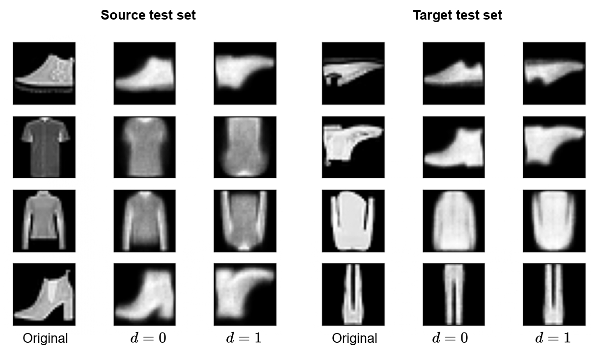

# Maximizing Information in Domain-Invariant Representation Improves Transfer Learning

## Requirements

 - TensorFlow=2.9.2 
 - Python 3.9

## Network Architecture

## Running the Experiment

This repository implements MaxDIRep and evaluates it on the benchmark datasets mentioned in the paper.

**Fashion-MNIST with cheating-bit** 

    python fm_nocheat.py
    python fm_random.py
    python fm_shift.py

**Office-31 dataset**

DSLR to Amazon, Webcam to Amazon, Webcam to DSLR, Amazon to DSLR

    python office_D_A.py
    python office_W_A.py
    python office_W_D.py
    python office_A_D.py

**Office-Home dataset**

Ar to Cl, Ar to Pr, Ar to Rw, Pr to Rw,  Rw to Pr

    python office_Ar_Cl.py
    python office_Ar_Pr.py
    python office_Ar_Rw.py
    python office_Pr_Rw.py
    python office_Rw_Pr.py

Due to GitHub's file size limitations, we have omitted the Fashion-MNIST synthetic dataset from this repository. It will be released publicly for study. 

[//]: # ()
[//]: # (## Results)

[//]: # (Fashion-MNIST with cheating-bit)

[//]: # (|  Model | No  cheating | Shift  cheating | Random  cheating |)

[//]: # (|--------|-------------|----------------|-----------------|)

[//]: # (| VAEGAN |        66.8 |           65.7 |            61.6 |)

[//]: # ()
[//]: # (CIFAR-10 with cheating-color-plane)

[//]: # (|  Model | 0%  bias | 20%  bias | 40%  bias | 60%  bias | 80%  bias | 90%  bias | 100%  bias |)

[//]: # (|--------|---------|----------|----------|----------|----------|----------|-----------|)

[//]: # (| VAEGAN |    70.4 |     69.8 |     69.8 | 69.7     | 68.3     | 64.1     | 34.2      |)

[//]: # ()
[//]: # (Digits datasets )

[//]: # (|  Model | MNINST to  MNIST-M | Synth Digits to  SVHN | SVHN to  MNIST |)

[//]: # (|--------|-------------------|----------------------|---------------|)

[//]: # (| VAEGAN |              81.0 |                 91.1 |          85.8 |)

### Reconstructed Images

 Effects of flipping the domain bit. Columns 1 and 4 are
the original images; columns 2 and 6 show reconstructions
of originals; columns 3 and 5 show reconstructions with the
domain bit flipped.