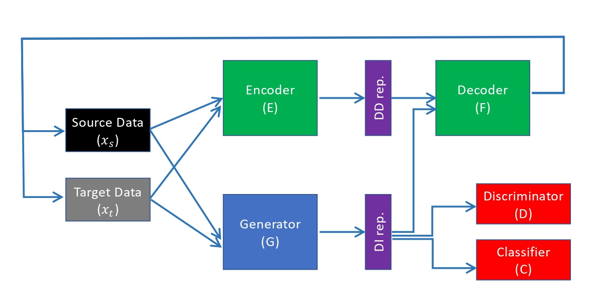

# Maximizing Information in Domain-Invariant Representation Improves Transfer Learning


## Requirements

 - TensorFlow=2.9.2 
 - Python 3.9


## Network Architecture





## Download the dataset 

Please download the [dataset](https://zenodo.org/records/16878116) from Zenodo and place it under the root directory. Run ```tar -xzvf data.tar.gz``` to unpack the compressed file and do not change the names of the extracted folders (the names should be ```/data``` and ```/pretrained_decoder```). 

Run ```pip install -r requirements.txt``` to install the required packages. 

## Running the Experiment

This repository implements MaxDIRep and evaluates it on the Fashion-MNIST, Office-31, Office-Home datasets mentioned in the paper.


**Fashion-MNIST with different cheating scenarios** 

    python /training/fm_nocheat.py
    python /training/fm_random.py
    python /training/fm_shift.py


**Office-31 dataset**

DSLR to Amazon, Webcam to Amazon, Webcam to DSLR, Amazon to DSLR

    python /training/office_D_A.py
    python /training/office_W_A.py
    python /training/office_W_D.py
    python /training/office_A_D.py


**Office-Home dataset**

Ar to Cl, Ar to Pr, Ar to Rw, Pr to Rw,  Rw to Pr

    python /training/office_Ar_Cl.py
    python /training/office_Ar_Pr.py
    python /training/office_Ar_Rw.py
    python /training/office_Pr_Rw.py
    python /training/office_Rw_Pr.py


## Citations

If you use this repository, please cite:
```
@inproceedings{li2025maximal,
  author    = {Li, Adrian Shuai and Bertino, Elisa and Dang, Xuan-Hong and Singla, Ankush and Tu, Yuhai and Wegman, Mark N.},
  title     = {Maximizing Information in Domain-Invariant Representation Improves Transfer Learning},
  booktitle = {2025 IEEE 11th International Conference on Collaboration and Internet Computing (CIC)},
  year      = {2025},
  publisher = {IEEE}
}

@misc{us-app-18129540,
  title        = {U.S. Patent Application},
  howpublished = {U.S. Patent Application No. 18/129{,}540},
  note         = {United States}
}
```